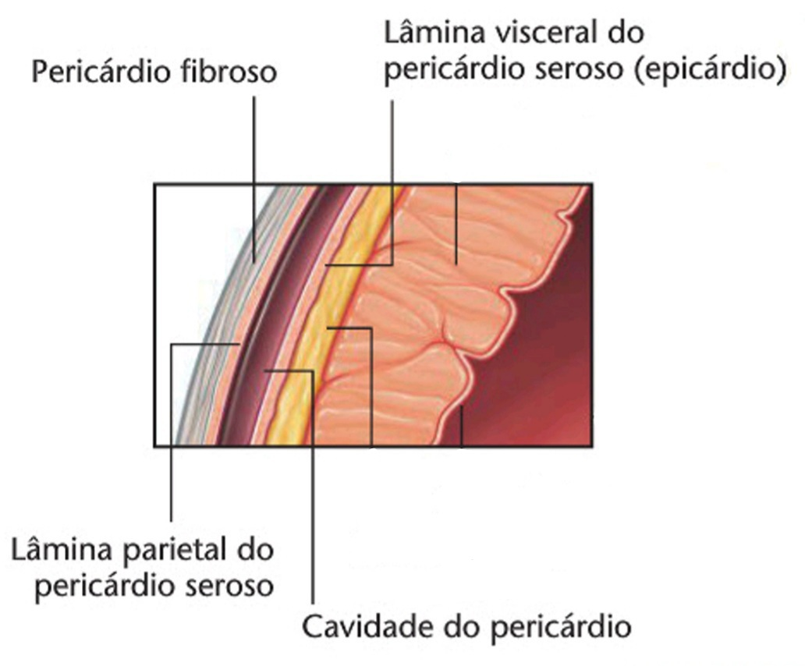

# Pericárdio, coração, aorta e seus ramos

## Pericárdio

O pericárdio contém o coração e as partes justacardíacas de seus grandes vasos. Ele consiste em dois componentes, o pericárdio fibroso e o pericárdio seroso. 

 

**Fig. 1**

O pericárdio fibroso é um saco constituído por um resistente tecido conjuntivo, que circunda completamente o coração sem estar aderido a ele. Suas paredes laterais são cobertas externamente pela parte mediastinal da pleura parietal. 

 **Fig. 2** 

O pericárdio seroso consiste em duas lâminas de pericárdio seroso, uma dentro da outra: a lâmina (ou folheto) visceral se adere ao coração e forma sua cobertura externa conhecida como epicárdio, enquanto que a lâmina (ou folheto) parietal reveste a superfície interna do pericárdio fibroso (_fig. 1_)

As duas superfícies serosas estão justapostas e separadas por uma camada de fluido. Este líquido permite o movimento da membrana interna e do coração aderido a ela, exceto nas áreas arteriais e venosas do pericárdio onde as duas lâminas serosas se mesclam nas reflexões do pericárdio (ou "linhas parietoviscerais").

 **Fig. 3** 

A separação das duas lâminas do pericárdio seroso cria um estreito espaço, a cavidade pericárdica (_fig. 1_), a qual proporciona uma separação completa entre o coração e seus arredores, assim permitindo a ele alguma liberdade para se movimentar e mudar de formato.

